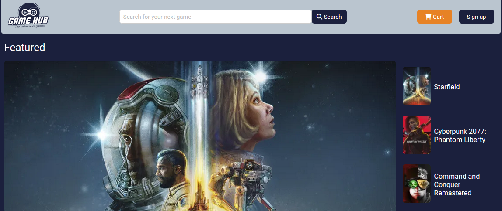

# CA-GameHub

Course assignment for HTML and CSS course for Frontend Development at Noroff School of Technology and Digital Media.

## Table of contents:
- [Description](#description)
    - [Features](#features)
    - [Built with](#built-with)
- [Requirements](#requirements)
- [Process](#process)
- [Installing](#installing)
    - [Running](#running)
- [Reflection](#reflection)
- [Contact](#contact)

## Description:

This project was part of the course assignment, at the end of the HTML and CSS course in the first semester of Front End Development at Noroff School of Technology and Digital Media.
The design of this project is based on the design I made for the course assignment, at the end of the Design course, during the first semester.
The project is a e-commerce website for a fictitious company called GameHub, that sells video games.

### Features
The page is deployed at Netlify [here](https://preeminent-madeleine-86cefd.netlify.app/).

The page consists of 8 pages:
- Home
- Product page
- Product detail page
- Cart
- Checkout
- Checkout success
- Contact page
- About page

### Built with

- Figma (Design and prototype)  
- HTML  
- CSS

## Requirements:

The course assignment had the following requirements:
- The HTML should be semantic and neatly formatted.
- The CSS should follow the DRY principles and be easy to read-The website should be responsive and look good at every screen size with no horizontal scrollbars. Use Flexbox and CSS Grids where appropriate. PLease do no use a CSS framework like Bootstrap; we want to see that you can build responsive websites without the use of a framework.
- The site should be WCAG compliant, and accessibility should be taken into account.
- Each page should have a unique \<meta name="description">, \<title> and \<h1>.
- You should not use copied code in your submission. All code submitted must be written by yourself, You may use external sources to show you how to achieve specific effects, which should be included in your report.

## Process:
I began the project by exporting all assets I had used in the figma design, converted them to webp and resizing them to comply with the 200kb limit declared in the course assignment marking criteria.

I set up a repository on github, added issues for all pages and sections as needed.

Created required html files and linked them with corresponding stylesheets, linked fontawesome and google-fonts, and declared all colors from the design system in :root of constants.css.

The design I had made in the design course was desktop-only.
This HTML and CSS course assignment called for a responsive design, so I made some quick prototypes in figma to plan out how I wanted the mobile version to look.
Then i began creating the pages one by one, mobile-first, starting with the homepage, div-ing up the design, adding content, adding styles and media queries last.
When I was mostly done with the pages, and they all were responsive, I jumped back and forth between pages as needed to polish, bug fix, etc.
I switched from deploying on Vercel to Netlify, and I made the contact form on the contact page work, just for fun :)

## Installing
Clone the project repository to your local machine.
```bash
git clone https://github.com/Eikhaugen/FED1-Project-Exam-1.git
```
### Running

Use webstorm, VSCode or any other code editor to run the project using liveserver.

## Reflection:
I think the course assignment went well, it was fun and a great learning experience going from a design to a static website using only HTML and CSS.

I did not make the burger-menu on mobile/tablet, I could have used "checkbox hack", or javascript, but the course assignment didn't require the use of javascript, and the most important part of the course assignment was to make a responsive, static, website.

I checked the code with W3C's markup validation service, it had six errors on the homepage that I promptly fixed. Four of the errors was for aria-labeling, one error was for using a slash "/" in a self closing tag </>.

I could probably work more on making the site WCAG compliant, I have done some aria-labeling and I have added alt-texts to images, but I think i could do better.
My code is also not very semantic.

There is a bug with the product-detail page where one div overflows, between mobile and desktop, it is a minor issue that I have not fixed.

## Contact

Find me here:

[My LinkedIn page](https://www.linkedin.com/in/thomas-eikhaugen-897234264/)  
[My GitHub page](https://github.com/Eikhaugen)
